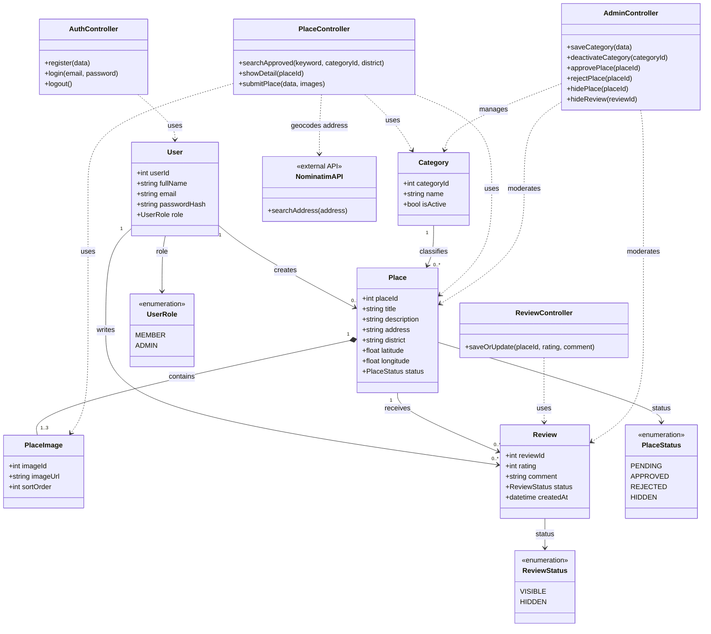
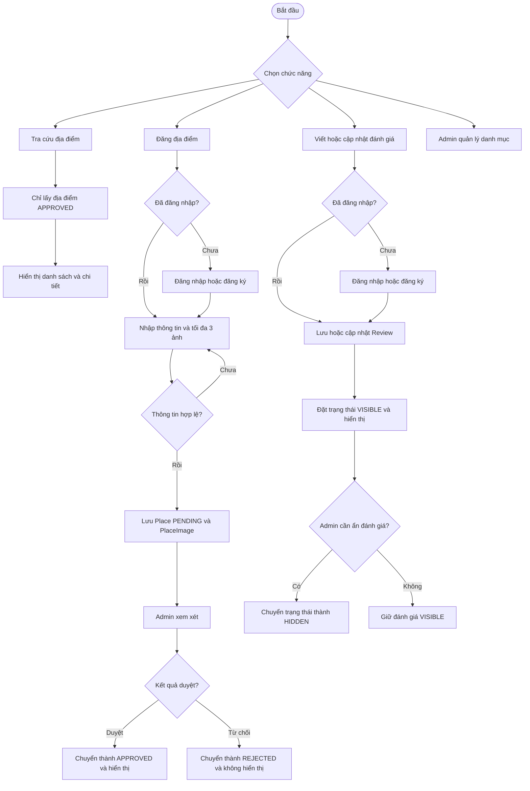

## Class Diagram

> `latitude` và `longitude` có thể để trống nếu không tích hợp API tọa độ. Nếu dự án chưa dùng Nominatim, xóa lớp `NominatimAPI` và quan hệ tương ứng. Cơ sở dữ liệu nên đặt ràng buộc `UNIQUE(userId, placeId)` để mỗi thành viên chỉ có một đánh giá cho một địa điểm.

## Business Flow

