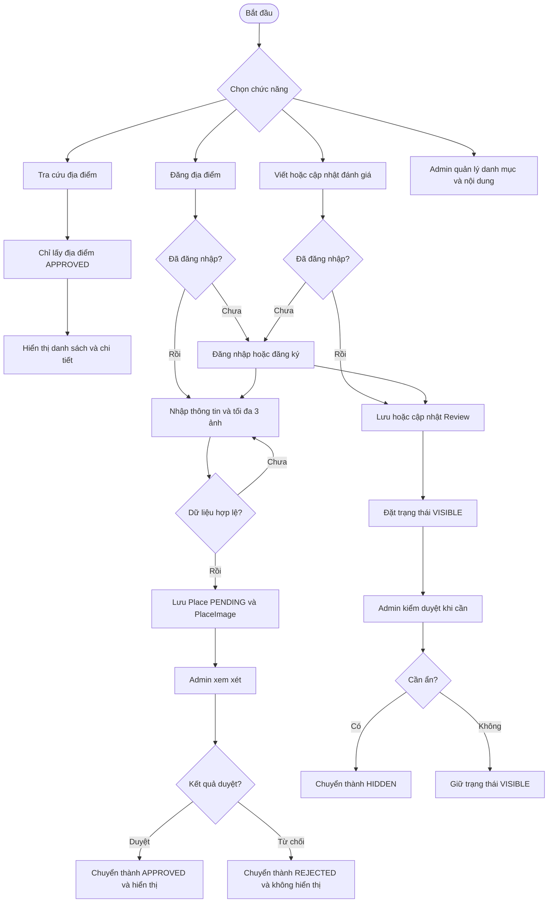
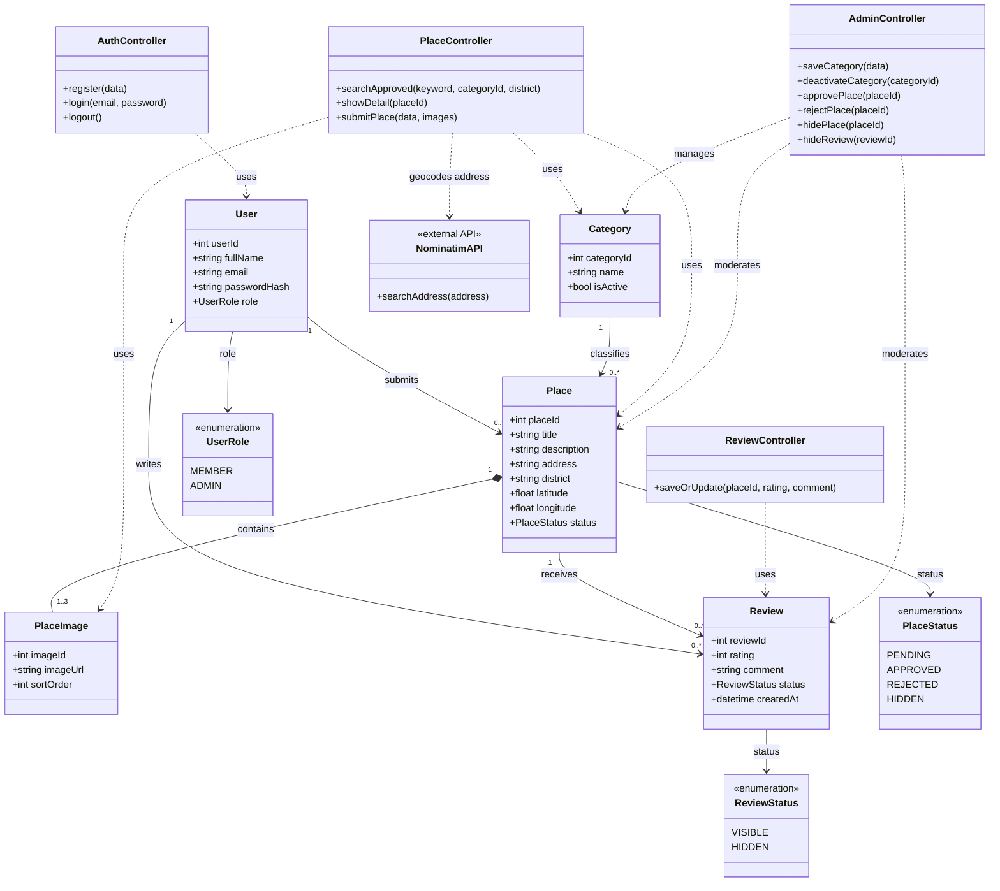

# Hot Spot

**Hot Spot** là website cộng đồng để khám phá và chia sẻ địa điểm ăn uống, du lịch và vui chơi. Khách có thể tìm địa điểm đã được duyệt; thành viên có thể đăng địa điểm, thêm ảnh và viết đánh giá; admin quản lý danh mục và kiểm duyệt nội dung.

## Mục tiêu

- Giúp người dùng tìm địa điểm theo từ khóa, danh mục và khu vực.
- Cho phép thành viên đóng góp địa điểm và đánh giá.
- Bảo đảm nội dung mới được admin duyệt trước khi hiển thị công khai.
- Giữ cấu trúc MVC đơn giản để các thành viên dễ đọc và cùng phát triển.

## Vai trò và chức năng

| Vai trò | Chức năng |
|---|---|
| Khách | Xem trang chủ; tìm kiếm, lọc và xem chi tiết địa điểm đã được duyệt. |
| Thành viên | Đăng ký, đăng nhập; gửi địa điểm kèm tối đa 3 ảnh; tạo hoặc cập nhật đánh giá. |
| Admin | Quản lý danh mục; duyệt, từ chối hoặc ẩn địa điểm; ẩn đánh giá không phù hợp. |

## Quy tắc nghiệp vụ

- Chỉ địa điểm có trạng thái `APPROVED` được hiển thị trong kết quả tìm kiếm công khai.
- Địa điểm mới được tạo với trạng thái `PENDING` và chờ admin duyệt.
- Mỗi địa điểm có tối đa 3 ảnh. File ảnh được lưu trong `public/uploads/places/`; bảng `PlaceImage` lưu đường dẫn ảnh và thứ tự hiển thị.
- Thành viên phải đăng nhập để đăng địa điểm hoặc viết đánh giá.
- Mỗi thành viên chỉ có một đánh giá cho một địa điểm. Nếu đánh giá lại, hệ thống cập nhật đánh giá hiện có. Cơ sở dữ liệu cần ràng buộc `UNIQUE(userId, placeId)`.
- Đánh giá mới có trạng thái `VISIBLE`; admin có thể chuyển thành `HIDDEN`.
- Trạng thái địa điểm: `PENDING`, `APPROVED`, `REJECTED`, `HIDDEN`.
- Trạng thái đánh giá: `VISIBLE`, `HIDDEN`.
- Phiên bản hiện tại không có chức năng lưu bản nháp và không có mục riêng cho đánh giá bị báo cáo.

## Công nghệ và cấu trúc

- **Backend:** PHP hướng đối tượng, tổ chức theo MVC.
- **Frontend:** HTML, CSS, JavaScript, Bootstrap.
- **Cơ sở dữ liệu:** Microsoft SQL Server.
- **Bản đồ/geocoding (nếu nhóm triển khai):** gọi API bên ngoài Nominatim để tìm tọa độ từ địa chỉ; Leaflet và OpenStreetMap dùng để hiển thị bản đồ. Tọa độ được lưu trong `Place` và có thể để trống nếu không tìm được.

Luồng xử lý chính:

```text
Browser → public/index.php → Controller → Model → SQL Server
                                      └──→ View trả về cho Browser
```

Ứng dụng dùng `public/index.php` làm điểm vào và điều hướng đến controller. Controller nhận yêu cầu, gọi model để đọc/ghi dữ liệu rồi trả về view. Bản MVP không cần Middleware hoặc một tầng Service riêng.

## Business Flow

Sơ đồ bao quát các luồng tìm kiếm, đăng địa điểm, đánh giá và kiểm duyệt:



## Class Diagram

Sơ đồ lớp dưới đây thể hiện controller, model, các trạng thái và quan hệ dữ liệu chính. `NominatimAPI` là dịch vụ bên ngoài, không phải API do nhóm tự xây dựng; có thể bỏ lớp này nếu không làm chức năng bản đồ/geocoding.



## Cấu trúc thư mục dự kiến

```text
hot-spot/
├── app/
│   ├── config/
│   │   ├── database.example.php
│   │   └── database.php              # Cấu hình máy cá nhân, không commit mật khẩu
│   ├── controllers/
│   │   ├── AuthController.php
│   │   ├── PlaceController.php
│   │   ├── ReviewController.php
│   │   └── AdminController.php
│   ├── helpers/
│   │   └── auth.php
│   ├── models/
│   │   ├── User.php
│   │   ├── Category.php
│   │   ├── Place.php
│   │   ├── PlaceImage.php
│   │   └── Review.php
│   └── views/
│       ├── layouts/
│       ├── auth/
│       ├── places/
│       ├── reviews/
│       └── admin/
├── database/
│   ├── schema.sql
│   └── seed.sql
├── public/
│   ├── index.php
│   ├── assets/
│   │   ├── css/
│   │   ├── js/
│   │   └── images/
│   └── uploads/
│       └── places/
├── .gitignore
└── README.md
```

## Cài đặt và chạy dự án

### Yêu cầu

- PHP 8.x.
- Microsoft SQL Server.
- PHP SQL Server driver mà dự án đang cấu hình (`PDO_SQLSRV` hoặc `SQLSRV`).
- Git.

### Các bước

1. Clone repository:

   ```bash
   git clone <repository-url>
   cd hot-spot
   ```

2. Tạo database trên SQL Server, sau đó chạy `database/schema.sql` và `database/seed.sql`.

3. Sao chép `app/config/database.example.php` thành `app/config/database.php`, rồi điền thông tin kết nối SQL Server trên máy của bạn. Không commit mật khẩu hoặc thông tin kết nối cá nhân.

4. Chạy website từ thư mục gốc dự án:

   ```bash
   php -S 127.0.0.1:8000 -t public
   ```

5. Mở `http://127.0.0.1:8000` trên trình duyệt.

## Phân công công việc cho 4 thành viên

Thay `Thành viên 2–4` bằng tên thật trước khi nộp README.

| Thành viên | Phụ trách | Sản phẩm bàn giao |
|---|---|---|
| **Khang – Nhóm trưởng** | Khởi tạo cấu trúc MVC; thiết kế và tạo database; cấu hình kết nối SQL Server; `public/index.php`; đăng ký, đăng nhập, đăng xuất và kiểm tra quyền cơ bản; tích hợp các nhánh Git. | `schema.sql`, cấu hình mẫu database, router, `AuthController`, `User`, helper xác thực; bản chạy tích hợp. |
| **Thành viên 2 – Khám phá địa điểm** | Trang chủ; danh sách địa điểm; tìm kiếm theo từ khóa, danh mục, quận/huyện; trang chi tiết; chỉ truy vấn địa điểm `APPROVED`. | `PlaceController` phần đọc/tìm kiếm, `Place` phần truy vấn, các view trang chủ/tìm kiếm/chi tiết. |
| **Thành viên 3 – Đóng góp và đánh giá** | Form đăng địa điểm; kiểm tra dữ liệu; tải tối đa 3 ảnh; lưu `Place` ở trạng thái `PENDING`; tạo và cập nhật đánh giá. | Chức năng gửi địa điểm, `PlaceImage`, `ReviewController`, form đánh giá và xử lý ảnh. |
| **Thành viên 4 – Trang quản trị** | Giao diện admin; thêm/ngừng danh mục; duyệt/từ chối/ẩn địa điểm; ẩn đánh giá; kiểm tra quyền admin. | Các view admin, chức năng quản lý danh mục và kiểm duyệt nội dung. |

### Quy ước phối hợp

- Thành viên 1 tạo schema và luồng chạy cơ bản trước; các thành viên còn lại thống nhất tên bảng, cột, route và cách gọi controller trước khi code.
- Mỗi người làm trên branch riêng, ví dụ `feature/place-search` hoặc `feature/admin-moderation`; không commit trực tiếp lên `main`.
- Mỗi chức năng cần tự kiểm tra thủ công trước khi tạo pull request. Nhóm trưởng tích hợp và kiểm tra lại các luồng chính sau khi merge.
- Nếu sửa schema, cập nhật `database/schema.sql` và báo cho cả nhóm để mọi người cập nhật database local.

## Checklist nghiệm thu MVP

- [ ] Khách xem và tìm được địa điểm đã duyệt.
- [ ] Thành viên đăng ký, đăng nhập và đăng xuất được.
- [ ] Thành viên gửi địa điểm với tối đa 3 ảnh; địa điểm mới ở trạng thái `PENDING`.
- [ ] Admin duyệt hoặc từ chối địa điểm; chỉ địa điểm `APPROVED` xuất hiện công khai.
- [ ] Thành viên tạo hoặc cập nhật một đánh giá cho mỗi địa điểm.
- [ ] Admin quản lý danh mục và ẩn được địa điểm hoặc đánh giá.
- [ ] Website chạy với hướng dẫn cài đặt trong README trên máy của thành viên khác.
