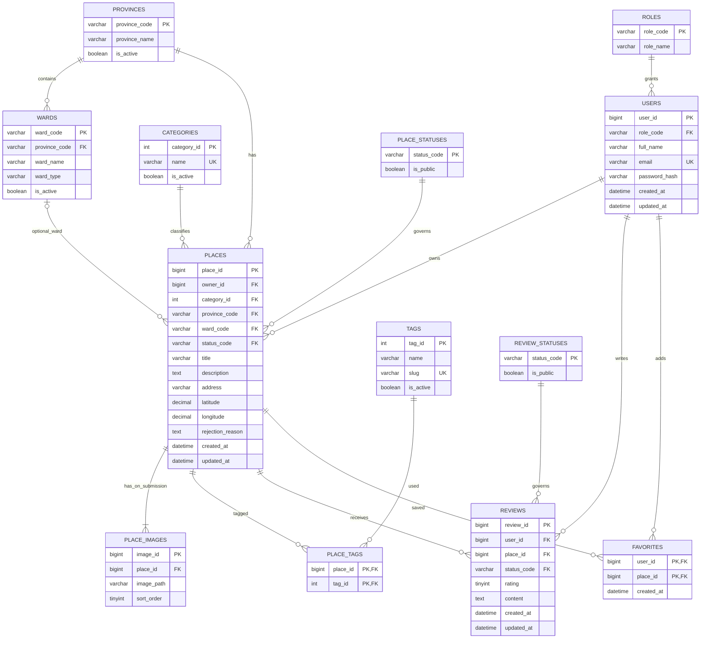

# 02 — ERD và thiết kế dữ liệu (13 bảng)

> Đích chính thức: MariaDB 10.4.32 (XAMPP). A02 đã import và kiểm thử schema 13 bảng; 12 routine và seed thuộc A03, chưa đưa vào repository này. Xem `reports/A01_A02_MARIADB.md`.

## A. ER Diagram

**Đọc quan hệ:** một `Province` có nhiều `Ward`; mỗi `Place` thuộc đúng một Province và có thể chưa chọn Ward; mỗi `Place` có từ **1–3 ảnh tại thời điểm gửi duyệt** (kiểm tra trong xử lý transaction, không chỉ dựa vào ký hiệu ERD); `place_tags` là bảng nối M:N giữa `places` và `tags`.

## B. Danh mục bảng, khóa và ràng buộc

| # | Bảng | PK | FK / kiểm tra then chốt |
|---:|---|---|---|
| 1 | `roles` | `role_code` | Chứa `MEMBER`, `ADMIN`; mã role duy nhất |
| 2 | `users` | `user_id` | `role_code → roles`; `email UNIQUE NOT NULL`; `password_hash NOT NULL` |
| 3 | `categories` | `category_id` | `name UNIQUE`; `is_active BOOLEAN` |
| 4 | `provinces` | `province_code` | Mã hành chính dạng **VARCHAR**; tên, trạng thái |
| 5 | `wards` | `ward_code` | `province_code → provinces`; mã cấp xã; UNIQUE(`province_code`,`ward_code`) để hỗ trợ FK ghép |
| 6 | `place_statuses` | `status_code` | `PENDING`, `APPROVED`, `REJECTED`, `HIDDEN`; `is_public` chỉ `APPROVED` |
| 7 | `places` | `place_id` | `owner_id → users`; `category_id → categories`; `province_code → provinces`; `status_code → place_statuses`; `ward_code` nullable; `rejection_reason` nullable |
| 8 | `place_images` | `image_id` | `place_id → places`; `UNIQUE(place_id,sort_order)`, `CHECK(sort_order BETWEEN 1 AND 3)` |
| 9 | `tags` | `tag_id` | `slug UNIQUE`; seed sẵn nhãn; `is_active` |
| 10 | `place_tags` | (`place_id`,`tag_id`) | `place_id → places`; `tag_id → tags`; số lượng tối đa 5 do Model kiểm tra |
| 11 | `review_statuses` | `status_code` | `VISIBLE`, `HIDDEN`; chỉ `VISIBLE` có `is_public=1` |
| 12 | `reviews` | `review_id` | `user_id → users`, `place_id → places`, `status_code → review_statuses`; `UNIQUE(user_id,place_id)`; `CHECK(rating BETWEEN 1 AND 5)` |
| 13 | `favorites` | (`user_id`,`place_id`) | Hai FK tương ứng `users`, `places`; chống trùng |

### Ràng buộc kỹ thuật sẽ triển khai

- `places.province_code NOT NULL`, `places.ward_code NULL`. Ràng buộc FK ghép `(province_code, ward_code) REFERENCES wards(province_code, ward_code)` khi ward được chọn. FK `province_code → provinces` bảo đảm tỉnh hợp lệ ngay cả khi ward `NULL`.
- Tọa độ dạng `DECIMAL(10,7)` hoặc kiểu DECIMAL chính xác tương đương; `CHECK`: latitude từ -90 đến 90, longitude từ -180 đến 180; cả hai cùng `NULL` hoặc cùng có giá trị.
- `places.rejection_reason`: bắt buộc có ý nghĩa khi chuyển trạng thái `REJECTED`, rỗng/xóa khi gửi lại thành công; điều kiện nghiệp vụ nằm trong Controller/Model/routine.
- `place_images`: DB có thể giới hạn tối đa 3 qua `sort_order` 1..3 + unique; **ít nhất 1 ảnh** và việc đồng bộ file với DB phải được kiểm tra trong transaction ứng dụng.
- `reviews.content` phải có ký tự có nghĩa sau `trim`; kiểm tra app và `NOT NULL`; `rating` 1..5. Một user/1 place chỉ 1 review.
- `favorites`, `place_tags` là PK ghép. Khi ẩn Place không xóa review/favorite/tag; danh sách công khai lọc PlaceStatus.
- `categories.is_active=0` không làm biến mất địa điểm cũ đã duyệt. Không thêm FK cascade làm mất bài, đánh giá hoặc yêu thích do xóa nhầm danh mục.
- Tất cả bảng InnoDB, `utf8mb4`; thời gian lưu UTC hoặc quy chuẩn timezone thống nhất, chuyển sang giờ Việt Nam tại UI.
- Index gợi ý: `places(status_code, province_code, category_id, created_at)`, `places(owner_id, status_code)`, `reviews(place_id,status_code)`, `wards(province_code, ward_name)`, `favorites(user_id)`; đánh giá lại bằng `EXPLAIN` khi đã có SQL.
- Ứng dụng không cho sửa các bảng danh mục hành chính tùy ý qua UI; seed theo nguồn chính thống.

## C. Seed và phạm vi dữ liệu

- Nguồn hành chính: **Quyết định 19/2025/QĐ-TTg**, danh mục hành chính Việt Nam hiệu lực từ 01/07/2025. Thiết kế dùng hai cấp `provinces` và `wards` (xã/phường/**đặc khu**). Theo danh mục công bố có 34 cấp tỉnh và 3.321 cấp xã tại thời điểm quy định; kiểm tra bản chính thức mới nhất trước khi tạo seed.
- Mã hành chính nên dùng chuỗi (ví dụ `VARCHAR(10)`) để bảo toàn số 0 đầu; không tự đánh số lại bằng AUTO_INCREMENT.
- Seed: roles, statuses, categories, danh mục hành chính, tags cố định (ví dụ `check-in`, `yen-tinh`, `gia-dinh`), 20–30 địa điểm trải nhiều tỉnh, ảnh bản quyền hợp lệ, 1 Admin và ít nhất 2 Member.
- Không seed password dưới dạng plaintext; hash bằng PHP hoặc công cụ sinh hash trước khi import. Không công khai tài khoản thật trong repo.

Nguồn chính thức: https://vanban.chinhphu.vn/?classid=1&docid=214409&orggroupid=3&pageid=27160

## D. 12 stored procedure — phân công đã chốt

Tên dưới đây là **tên logic**. Khi triển khai, thêm tiền tố viết tắt tên thành viên vào tên SQL thực tế (thí dụ `KH_CREATE_USER`; TV2–TV4 thay tên viết tắt sau khi có danh sách nhóm). Lập mapping một lần để PHP gọi thống nhất.

| Chủ trì | Routine logic | I/O và trách nhiệm |
|---|---|---|
| Khang | `CREATE_USER` | Input full_name/email/password_hash; kiểm tra email trùng; trả ID hoặc lỗi |
| Khang | `GET_USER_BY_EMAIL` | Input email; trả `user_id,role_code,password_hash,...` phục vụ PHP verify hash |
| Khang | `SET_FAVORITE` | Input session user_id, place_id, desired flag; thêm/bỏ **idempotent**; chặn địa điểm không `APPROVED` |
| TV2 | `LIST_ACTIVE_CATEGORIES` | Trả danh mục `is_active=1` để chọn bài mới |
| TV2 | `SEARCH_APPROVED_PLACES` | Từ khóa + danh mục + tỉnh/phường + pagination; chỉ `APPROVED`; **không loại bài cũ chỉ vì danh mục đã tắt** |
| TV2 | `LIST_WARDS_BY_PROVINCE` | Mã tỉnh; trả wards tương ứng, sắp xếp tên |
| TV3 | `SUBMIT_PLACE` | Tạo Place `PENDING` từ chủ tài khoản, province và category hợp lệ |
| TV3 | `ADD_PLACE_IMAGE` | Thêm 1 ảnh theo `sort_order` 1..3; xác thực quyền sở hữu/dữ liệu |
| TV3 | `RESUBMIT_PLACE` | Chủ bài sửa `PENDING`/`REJECTED`; giữ/đưa về `PENDING`, xóa lý do từ chối khi gửi lại; đồng bộ ảnh/tag trong Model |
| TV4 | `SAVE_OR_UPDATE_REVIEW` | Upsert một review/người/địa điểm; 1–5 sao + content; nếu cũ `HIDDEN` thì **vẫn HIDDEN** |
| TV4 | `SET_REVIEW_STATUS` | Admin ẩn (`HIDDEN`) hoặc khôi phục (`VISIBLE`) |
| TV4 | `SET_PLACE_STATUS` | Admin duyệt/từ chối (kèm lý do)/ẩn/khôi phục, kiểm tra chuyển trạng thái hợp lệ |

**Các truy vấn không có procedure riêng:** update profile, lấy địa điểm của mình, lấy favorites/reviewed places, lấy tags, admin CRUD categories, hiển thị thống kê dashboard cơ bản. Làm bằng PDO trong Model.

**Transaction:** Controller/Model mở PDO transaction ở trường hợp nhiều thao tác; procedure **không tự COMMIT** để tránh phá transaction bên ngoài. Xử lý upload file ở ứng dụng và dọn file nếu rollback. Khi gọi nhiều CALL liên tiếp bằng PDO (`pdo_mysql`), giải phóng result set/cursor trước CALL tiếp theo.

## E. Trạng thái thực hiện

- A02: 13 bảng, 13 PK, 15 FK, 7 UNIQUE, 15 CHECK đã kiểm thử trên MariaDB 10.4.32; FK/CHECK luôn bật. Tên bảng/cột, quan hệ, số ràng buộc và phân công giữ nguyên.
- CHECK chuỗi dùng `REGEXP '[^[:space:]]'` để không chấp nhận chỉ tab/xuống dòng. `TRIM()` đơn thuần không bảo vệ quy tắc này. CHECK lý do từ chối giữ điều kiện status REJECTED.
- Giữ `ON UPDATE CASCADE`/`ON DELETE RESTRICT` và FK tỉnh/phường ghép. Không cần bỏ CHECK để import trên MariaDB.
- A03: nhập seed đã kiểm chứng và 12 routine, kiểm thử CALL/rollback/quyền trên MariaDB 10.4.32. Chưa triển khai hay kiểm thử routine trong A02.
- Các invariant liên bảng (địa điểm công khai có ít nhất 1 ảnh, tối đa 5 tag, quyền owner/admin, chuyển trạng thái) vẫn phải được thực thi ở routine/Model; A02 không tuyên bố đã đáp ứng các invariant này.
