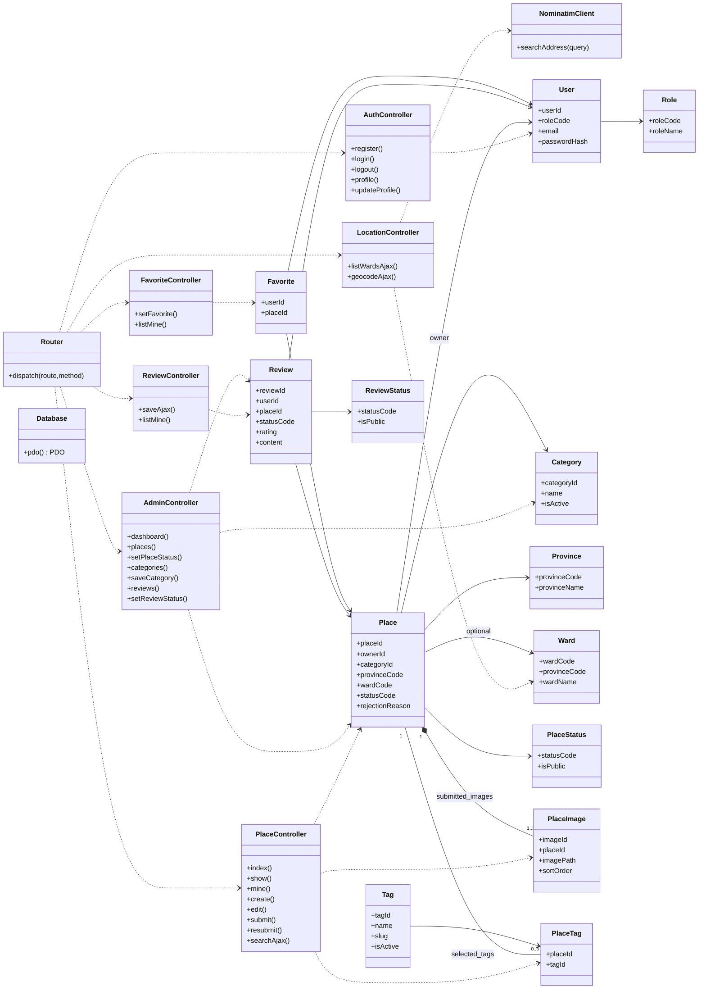

# 03 — Class Diagram (PHP OOP + MVC)

> Thiết kế đã chốt để nhóm tham khảo. Source hiện là bộ khung với các file xử lý rỗng; chưa triển khai MVC/Auth hoặc module nghiệp vụ.

> Mô tả các lớp dự kiến cho **13 bảng**, sáu Controller, Router/Database và Nominatim. **Chưa phải PHP code đã tồn tại.**

## Quy ước thiết kế

- **Router** đọc `?route=...` và phương thức HTTP rồi gọi Controller tương ứng; xử lý 404/405.
- **Controller** kiểm tra Session, quyền, CSRF, validate input; điều phối Model rồi trả HTML View hoặc JSON.
- **Model** chứa truy vấn PDO, routine, mapping dữ liệu và các transaction nghiệp vụ. Không dùng SQL trực tiếp trong View.
- **13 lớp Model** bám theo 13 bảng DB (mỗi Model không nhất thiết phải có đầy đủ CRUD công khai).
- `NominatimClient` chỉ làm adapter HTTP tới nhà cung cấp ngoài và cache; `LocationController` nhận request geocode, không đưa logic API vào View.
- Các lớp `Role`, `PlaceStatus`, `ReviewStatus` là Model tra cứu nhẹ, không cần tầng Service/Middleware. Helper dùng chung (`auth`, `csrf`, `response`) không phải lớp nghiệp vụ.

## Các thao tác quan trọng

| Controller | Nhóm nhiệm vụ |
|---|---|
| `AuthController` | Đăng ký/đăng nhập/đăng xuất, hiển thị/sửa hồ sơ |
| `PlaceController` | Trang chủ, chi tiết, danh sách của tôi, form đăng/sửa/gửi lại, tìm kiếm AJAX |
| `FavoriteController` | Đặt trạng thái yêu thích, xem danh sách |
| `ReviewController` | Lưu/cập nhật đánh giá, xem địa điểm đã bình luận |
| `LocationController` | Danh sách phường/xã theo tỉnh, geocoding qua PHP |
| `AdminController` | Dashboard, danh mục, duyệt/từ chối/ẩn/khôi phục địa điểm, ẩn/khôi phục review |

**Lưu ý:** Quan hệ `Place–PlaceImage` có 1–3 ảnh **khi gửi duyệt**, không có nghĩa FK tự bảo đảm tối thiểu 1. `Place–PlaceTag` tối đa 5 cũng được kiểm tra bởi Model/Controller. Đây là các invariant cần được test thủ công.
