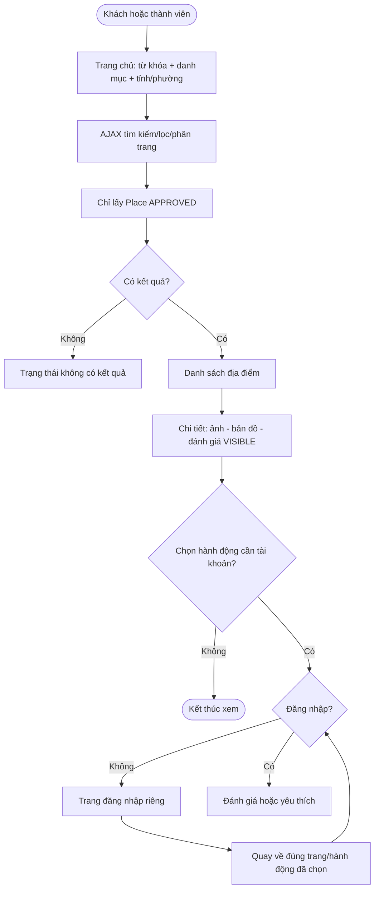
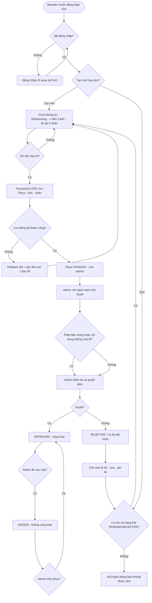
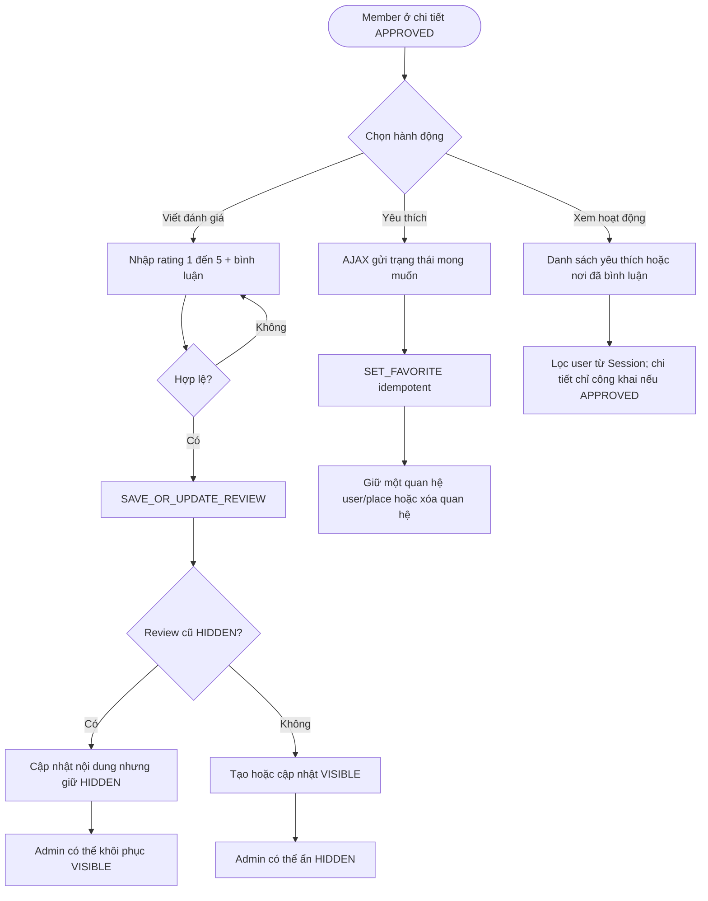
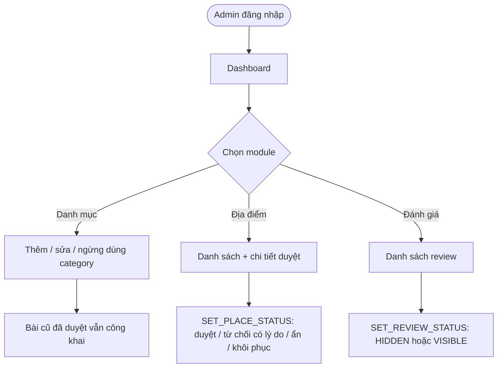

# 04 — Business Flow

> Thiết kế đã chốt để nhóm tham khảo. Core MVC/Auth đã có; các module nghiệp vụ trong tài liệu này chưa được triển khai đầy đủ.

> Luồng sử dụng đã chốt. Mọi kiểm tra truy cập phải xảy ra trên server, kể cả khi người dùng tự gọi URL hoặc AJAX endpoint.

## 1. Khám phá địa điểm

- Màn hình tìm kiếm chính nằm **ngay trên trang chủ**. Kết quả hỗ trợ loading, empty, error.
- Chỉ xem `APPROVED`; review công khai phải `VISIBLE`. Bài thuộc category `is_active=0` vẫn tìm thấy nếu đã duyệt.
- Nếu khách chọn đánh giá/yêu thích, hiển thị login riêng và quay lại chức năng ban đầu.

## 2. Gửi mới, sửa và kiểm duyệt địa điểm

- Khi sửa bài `PENDING`, dữ liệu cập nhật vẫn ở `PENDING`. Khi sửa/gửi lại `REJECTED`, trở về `PENDING`, xóa lý do cũ sau khi thành công.
- Mỗi lần gửi kiểm tra 1–3 ảnh, tối đa 5 tag, tỉnh bắt buộc, phường hợp lệ và category không bị vô hiệu với bài mới.
- Quyền sửa chỉ dành cho **chủ bài**, không theo role member chung. Admin thực hiện duyệt/từ chối và đổi trạng thái, không thay tác giả sửa mô tả.
- Nếu cùng tên/địa chỉ: cảnh báo, **không tự từ chối**; admin quyết định.
- API tìm tọa độ bằng PHP/Nominatim sau khi bấm nút; thất bại có thể chọn điểm thủ công trên bản đồ hoặc không có tọa độ.

## 3. Đánh giá, yêu thích và hoạt động cá nhân

- Đánh giá bắt buộc sao + bình luận. Review đã ẩn chỉ admin được khôi phục; chủ review sửa không làm công khai.
- Yêu thích gửi **trạng thái mong muốn** `is_favorite=true/false`, chống thêm lặp. Chỉ nơi `APPROVED` cho thêm yêu thích.
- Danh sách nơi đã bình luận là truy vấn `reviews JOIN places`, không phải bảng lịch sử mới.

## 4. Quản trị danh mục và đánh giá

## 5. Trạng thái lỗi bắt buộc trên UI

- `401`: khách chưa đăng nhập → login, có thông tin điều hướng quay về.
- `403`: không phải chủ bài hoặc không phải Admin → chặn ở Controller, không thay đổi DB.
- `404`: không có địa điểm công khai hoặc không tồn tại.
- `422`: dữ liệu form không hợp lệ → nêu lỗi từng trường, giữ dữ liệu đã nhập hợp lý.
- `409`: xung đột (ví dụ trạng thái đã thay đổi, dữ liệu trùng email).
- `429/502/503`: geocoding/API lỗi hoặc vượt hạn mức → hiển thị thông báo, vẫn cho chọn vị trí thủ công nếu có thể.
- Nút submit có loading/disable trong lúc gửi; không tạo trùng dữ liệu khi người dùng bấm liên tiếp.
