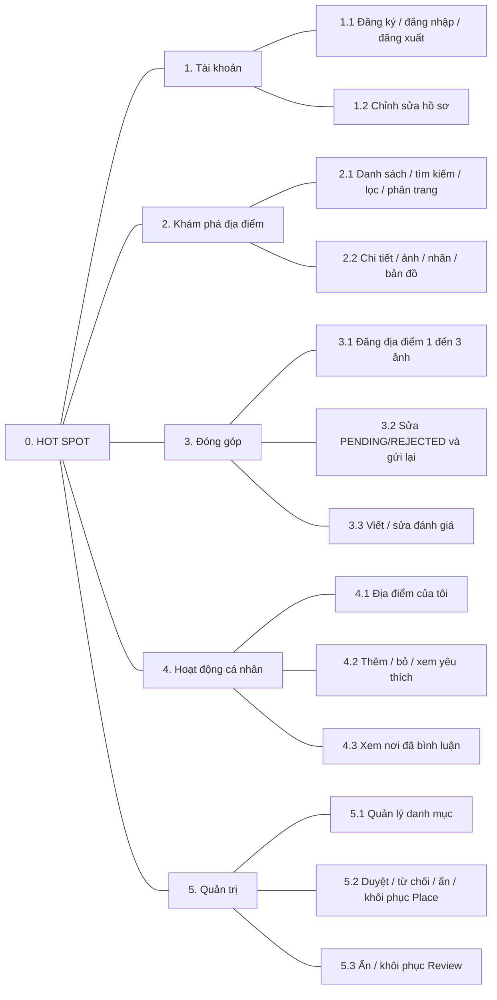

# 09 — Sơ đồ phân rã chức năng Hot Spot

> Thiết kế đã chốt để nhóm tham khảo. Source hiện là bộ khung với các file xử lý rỗng; chưa triển khai MVC/Auth hoặc module nghiệp vụ.

Sơ đồ chia Hot Spot thành **5 nhóm chức năng chính**. Đường nối chỉ là quan hệ **cha–con**, không biểu thị thứ tự xử lý. Các flow theo trình tự nằm tại [Business Flow](04_BUSINESS_FLOWS.md).

| Nhóm | Thành phần chính | Người phụ trách nghiệp vụ |
|---|---|---|
| 1. Tài khoản | Đăng ký, đăng nhập, đăng xuất, hồ sơ | Khang |
| 2. Khám phá | Danh sách, tìm/lọc/phân trang, chi tiết, bản đồ | TV2 tìm kiếm; TV3 chi tiết/bản đồ |
| 3. Đóng góp | Gửi/sửa/gửi lại Place và ảnh, đánh giá | TV3 địa điểm; TV4 đánh giá |
| 4. Cá nhân | Địa điểm của tôi, yêu thích, nơi đã bình luận | TV3 địa điểm; Khang yêu thích; TV4 bình luận |
| 5. Admin | Quản lý danh mục, duyệt/từ chối/ẩn/khôi phục Place và Review | TV4 **toàn bộ** |

Không tạo nhánh thanh toán, đặt bàn, chat, bản nháp hoặc báo cáo nội dung vì các tính năng đó đã bị loại khỏi MVP.
